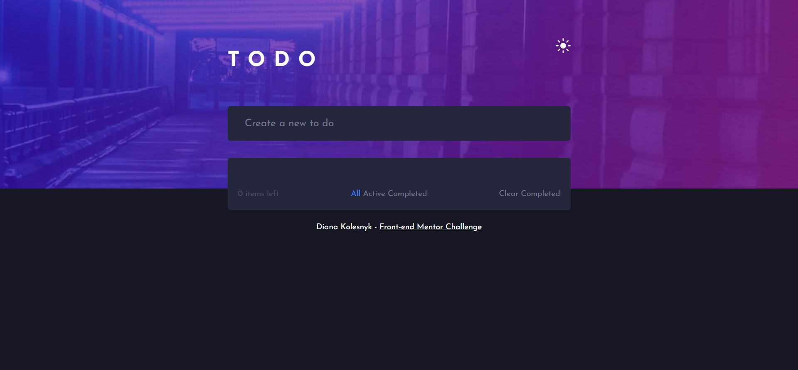
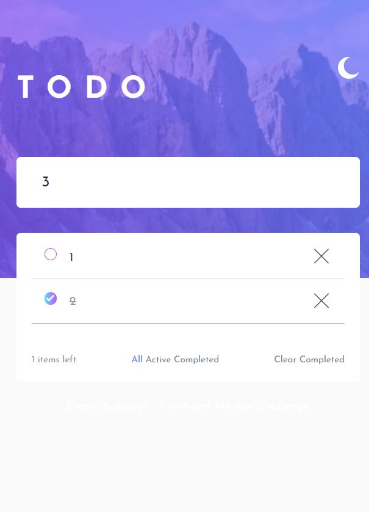

# Frontend Mentor - Todo app solution

This is a solution to the [Todo app challenge on Frontend Mentor](https://www.frontendmentor.io/challenges/todo-app-Su1_KokOW). Frontend Mentor challenges help you improve your coding skills by building realistic projects. 

## Table of contents

- [Overview](#overview)
  - [The challenge](#the-challenge)
  - [Screenshot](#screenshot)
  - [Links](#links)
- [My process](#my-process)
  - [Built with](#built-with)
  - [What I learned](#what-i-learned)
  - [Continued development](#continued-development)
  - [Useful resources](#useful-resources)
- [Author](#author)
- [Acknowledgments](#acknowledgments)

**Note: Delete this note and update the table of contents based on what sections you keep.**

## Overview

### The challenge

Users should be able to:

- View the optimal layout for the app depending on their device's screen size
- See hover states for all interactive elements on the page
- Add new todos to the list
- Mark todos as complete
- Delete todos from the list
- Filter by all/active/complete todos
- Clear all completed todos
- Toggle light and dark mode
- **Bonus**: Drag and drop to reorder items on the list

### Screenshot





### Links

- Live Site URL: [Add live site URL here](https://your-live-site-url.com)

## My process

After the careful observation of the design for this project, I started to identify and divide the document per parts, imagine the possible solutions for make the front-end part, for Desktop and Mobile. 

I have started with HTML. I divided the document by:
- Header which includes "TODO" and the images for dark/light mode;
- Todo input;
- Another div for errors;
- Div which will contain the TODO tasks;
- Div for filters: 
       - Div for number of TODOs to complete;
       - Div for filtration;
       - Div for a btn to clear all the tasks.
ALL those division were associated to a Class Box, in order to make easier the responsiveness. 

Second step was working in the same time with CSS and Javascript. 

Starting with CSS: 

- As one of the challenges was having dark and light mode, I created variables with the corresponded colors for each mode, so as a result I had two themes, and instead of defining the color for each section in HTML, the variables are in use.

- Then in JS, I created a constant, which would contain the two images, 1 for dark mode and the other one for light mode. 
So, on click on the image,  the data-theme changes to light, and the light image apears instead of dark-one. The other code does the opposite, changing data-theme do dark.
As data-theme changes(it's located inside HEAD element), CSS variables are controlling the rest.

- Body has associated the font-famoly Josefin Sans, which was imported from Google Fonts. The background image, and the other "changeble" elements have the variables associated. 
I got some problems to place the image width 100%, because it never occupied the full screen, so the solution I got was to define the size as 160rem.

- Header section has display:flex in order to make the TODO text and the image appear in the same line, with some space between them. 


- To avoid having two images for the theme to appear, both of them were hiden. Also there were added some effects and after that, the image with a class active is going to appear.

After this first part of interaction with CSS, it's time to interact with JS.

- To make it easier and for better organization, some constants were created to be reached faster.

- The following function, after the enter click, verifies the error existance and if it's true, it will appear with the respective message. If there is no error, the message error disappears and inside the div with id="to-do-tasks" will be created/attached 3 spans: 1 for the check, 2 for the text and the 3 for the delete. Also the tasks number updates.

- The next function works with delete option, so when there is a click on the object, the function verifies if the there is a classe with the name "delete" associated to the object. If it's true, the Parent Element (the main span) will be deleted. Also it is going to verify if the main span has another span inside with the class "is checked". If it is NOT true, the number of tasks to colpete will decrease.
If the clicked object has the classlist "Check-box", it is going to remove the class(in order to make it unchecked) and also remove the class task finished. Also does the opposite.

- Regarding the filter buttons. The respective class will be associated to the button. After that, all the spans will be verified.

- The last function is used in previous one to clean the "selected" class, to avoid having more than one class selected, appearing with the blue color.


### Built with

- Semantic HTML5 markup
- CSS custom properties
- Flexbox
- CSS Grid
- Javascript

### What I learned

While working on this project, I got a better understanding of CSS. I had to work many options to make the app responsive, and also to got tham in the right position was a challenge.It was good to practive the positioning of the elements (display, float...) and also the @media. 

An example of this is the code for the #filter:

#filter{
    background-color: var(--todo-container-bg-color);
    margin:0 auto; 
    display: flex;
    justify-content: space-between; 
    border-radius: 0 0 5px 5px; 
}


```CSS: I am proud of this code, which helped me a lot to make it right the part of dark/light theme.

[data-theme="light"]{
    --bg-color:hsl(0, 0%, 98%);
    --bg-image:url('images/bg-desktop-light.jpg');
    --todo-container-bg-color:hsl(240, 100%, 100%);
    --header-color:hsl(233, 11%, 84%);
    --filter-selected: hsl(220, 98%, 61%);
    --border-color:hsl(0, 0%, 77%);
    --tasks-finished:hsl(236, 9%, 61%);
    --filter-hover:hsl(235, 19%, 35%);
    --filter-txt:hsl(234, 11%, 52%);
    --txt-color:hsl(235, 24%, 19%);
    --check-background:linear-gradient(to right, hsl(192, 100%, 67%) 0%, hsl(280, 87%, 65%) 100%);
   
}

[data-theme="dark"]{
    --bg-color:hsl(235, 21%, 11%);
    --bg-image:url('images/bg-desktop-dark.jpg');
    --todo-container-bg-color:hsl(235, 24%, 19%);
    --header-color:white;
    --txt-color:hsl(240, 43%, 83%);
    --filter-hover:hsl(236, 33%, 92%);
    --filter-selected: hsl(220, 98%, 61%);
    --filter-txt:hsl(234, 11%, 52%);
    --border-color:hsl(234, 11%, 52%);;
    --tasks-finished:hsl(233, 14%, 35%);
    --check-background:linear-gradient(to right, hsl(192, 100%, 67%) 0%, hsl(280, 87%, 65%) 100%);

}

```js, I am very proud of JS Code, but specially the code that has parentElement and childElement, that I have never worked before.

document.addEventListener("click",(o) => {
    
    if(o.target.classList.contains("delete")){ 
        o.target.parentElement.remove(); // vai eliminar o span principal

        if(!o.target.parentElement.childNodes[0].classList.contains("ischecked")){
           // errorExist.style.display = "none"; 
            itemsLeft--;
            itemsLeftDom.textContent = itemsLeft;
            errorExist.style.display = "none";
            return;
        }
     
    }
} 

(...)

        else{
            for(let i=0;i<allTasksList.length;i++){
                if(inputTask.value == allTasksList[i].childNodes[1].textContent){ // vai ao task container (aos spans tds), e vai ler o texto do 2 elemento
                 // console.log(allTasksList[i].childNodes[1])
                    inputTask.value = '';
                    errorExist.style.display = "block";
                    errorExist.textContent = "This task already exists";
                    return;
                }
            }
            //will create the task
            errorExist.style.display = "none"; 
       //  inputTask.classList.remove("empty");
            allTasks.appendChild(task); 
            task.appendChild(taskChecker); 
            task.appendChild(taskText);
            task.appendChild(taskDelete); 
            inputTask.value = '';
            itemsLeft++;
            itemsLeftDom.textContent = itemsLeft; 
        }`


To realize this code, I had to search a lot. Specially grateful to https://www.w3schools.com/ that always provide good examples and clear explanation. Also reviewing other peoples code to similar projects and video tutorials gave me some ideas of how to organize the information.


### Continued development

This project still needs some improvements, so the next steps will be:
- Add drag and Drop option;
- Improve the responsiveness on mobile design. The filter part is not finished as desired.

### Useful resources

## Author

Diana Kolesnyk

- Frontend Mentor - [@dianakolesnyk](https://www.frontendmentor.io/profile/dianakolesnyk)

# to_do_app_js

